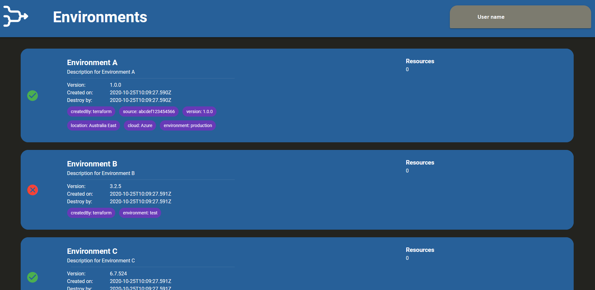

# service.provisioning.ui

The `service.provisioning.controller` repository is part of the group of
[provisioning services](https://github.com/Calvinverse?q=topic%3Aprovisioning&type=&language=).
This group consists of services and tools which allow users to provision a complete environment from
scratch and upgrade existing ones with new components. In this case an environment is defined as

  > An **environment** is a collection of resource instances and services that work together
  > to achieve one or more goals, e.g. to provide the ability to serve customers with
  > the ability to create, edit and store notes.

## Goals

The `service.provisioning.ui.web` service provides a web UI that allows the user to view information about known environments as well as allowing the user to create new environments and update or delete existing environments.

## Development

### Building

The `build.ps1` powershell script is used to build the artefacts. If this script is invoked
with:

    ./build.ps1 -Direct

then it will build both the `Golang` service and the `vue.js` website to the local `/bin` directory.
From there you can run the service by executing the following command

    ./bin/server.exe server --config ./bin/config.yaml

If you want to put the service in a container then you can invoke the script as:

    ./build.ps1 -dockerTags 'tag1,tag2,tag3'

which builds a Docker container with the given tags.

## Attributions

* Icon based on the [Categories](https://thenounproject.com/search/?creator=718857&q=categories&i=249390) icon
  created by [Marie Van den Broek](https://thenounproject.com/marie49/).
